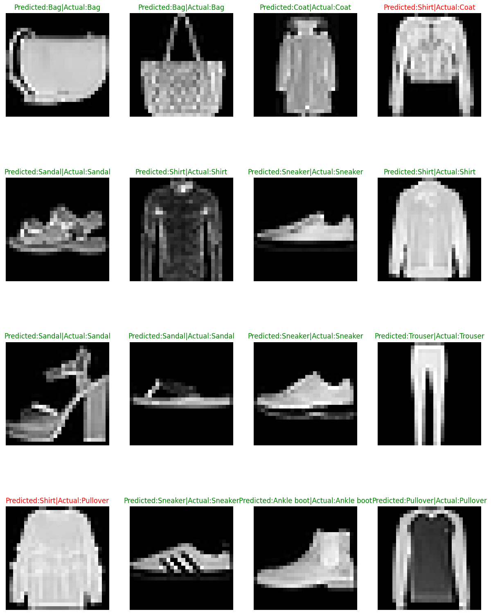
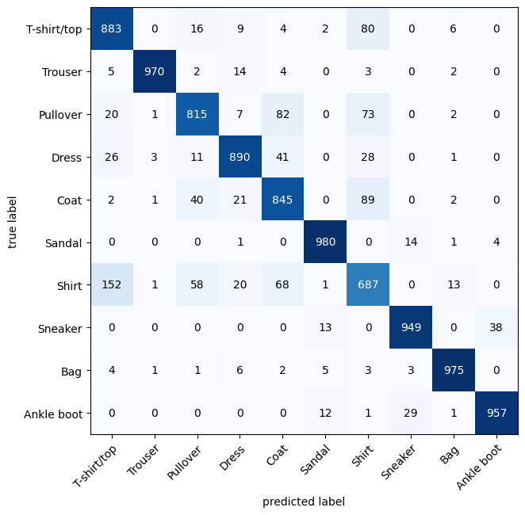

# PREDICTING DIFFERENT CLOTHES USING PYTORCH

# Table of content
- [Objective](#objective)
- [Data Source](#data)
- [Procedure](#procedure)
- [Usage](#usage)

# Objective
In this project I have created a ML model which will predict different clothes given in FashionMNIST database leveraging the power of PyTorch. If we input a greyscaled image of size 28x28 in the form of tensor the model will predict the cloth item with an accuracy around 88%-90%.

# Data 

For this project we have used the fashionMNSIT data which is available at torchvision datasets. You can view the data in this [**repository**](https://github.com/zalandoresearch/fashion-mnist?tab=readme-ov-file).


# Procedure

- **Exploratory Data Analysis**

    In this process we briefly analyzed the data, checked for any null values or missing points in the data. We found that the size of the tensor is of the form [1 ,28 ,28] representing the color channels(here only gray), width and height.
- **Model Training**

    The model was trained using nearly 86% of the data and divided the data into batch of size 32.
    The loss function used was Cross Entropy and we used stochastic gradient descent optimizer.
    To train the model we have used Convolution Neural Network with TinyVGG architecture

    
- **Model Evaluation**

    The Performance of the model was done using Torchmetrics accuracy and by creating.
    The accuracy metrics showed an accuracy of nearly 90% which is suitable for solving real life problems
    
    

    confusion matrix
    

# Usage
The model was saved using pyTorch's save method which saves models in pickle format. It can be easily accessed using pyTorch's load method

**How to Load and Use the Saved Model**

After downloading the saved model file (student_scores_model.pth), you can load it in PyTorch and use it to make predictions. Follow the steps below:
1. Make sure that PyTorch is installed or else install using pip

    ```bash
    pip install torch

2. Create an instance of the class from model.py

    ```python
    from model import FashionMNISTModelV0
    model_0 = FashionMNISTModelV0(1,10,9)

3. Load the state dictionary of the model
    ```python
    model_0.load_state_dict(torch.load(f="models/fashion_mnist_model_v0.pth"))
    model_0.to("cuda") #if you have any device preference
4. Make Prediction
    ```python
    from model import make_predicion
    prediction = make_prediction(model_0,img)
    #img - image in Tensor of shape [1,28,28]
    #This will return a value from 0 to 9 which are labels in our data